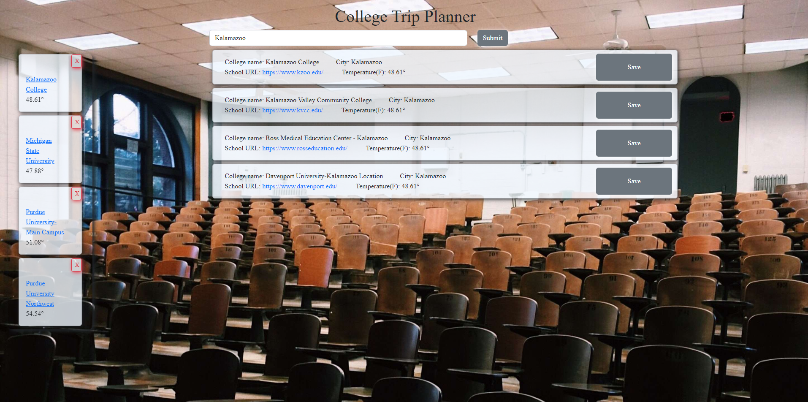

# Project1 - College Trip Planner
## Contributors: 
    - Shawn Karalash
    - Eric Brooks
    - Sam Bensema
    - Andrew Ceballos

View this site live at https://ralakash.github.io/CollegeTrip/

## About the Project
The inspiration behind this project was to provide those going back to college with the basic information about the colleges they would be visiting and about the weather in the area. As former students ourselves, we know how intimidating college visits can be. We wanted to make it as easy as possible and give potential students all the information they would need about the area they would be visiting in one place. This projects allows students to search for a college or colleges they will be visiting, they then would be given the information about the college, including a link to the schools website, and the college's current local weather. Students then have the ability to save their schools which will collect and be viewable on the left side of the website for future reference.

## Built With
Bootstrap 5,
jQuery,
APIs: 
School Data - collegescorecard.ed.gov,
Weather - openweathermap.org

## Usage
To use this site, start out by searching for a school you plan to visit in the search bar. Cards for the school or schools will appear below the search bar, all cards will include the name of the school, city it is located, a link to the school's site, and the current local weather. Skim through the cards until you find the school you're looking for. Once you have found the school, you can click the save button on the right side of the school's card to save your search. Previous saved searches are viewable on the left side of the website's page.